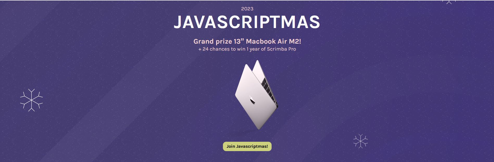

# Scrimba-JavaScriptmas
### Repository to store all my submission for Scrimba's JavaScriptmas - Hopefully i win the macbook too

## SETUP
1. Clone the repository

   `git clone https://github.com/maryjonah/Scrimba-JavaScriptmas.git`

2. Change to the **submission** folder where each day's submission is expected to be stored.

3. For html and css submissions, you can double click the html file and the work is opened in a browser.

## SUBMISSIONS
#### 🎄DAY 2: [Style a Colorful Button](./submissions/day_02/README.md).
#### 🎄DAY 3: [Divide Candy](./submissions/day_03/README.md).
#### 🎄DAY 4: [AI Christmas Joke Generator](./submissions/day_04/README.md).